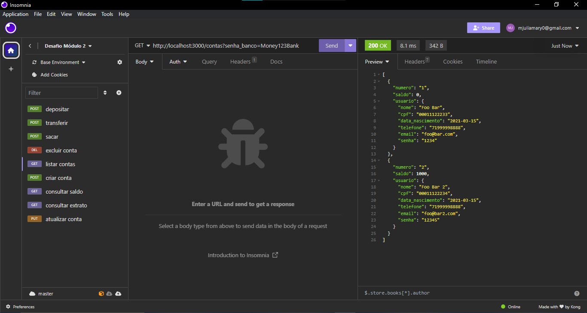
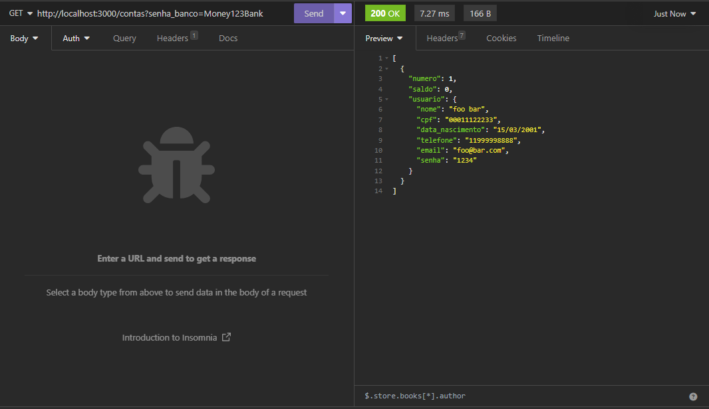
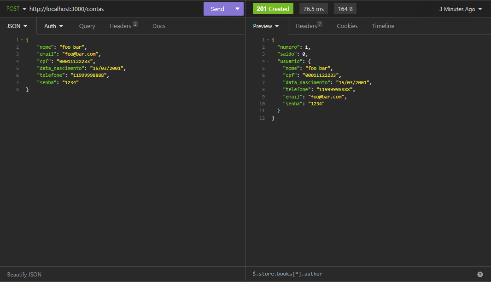
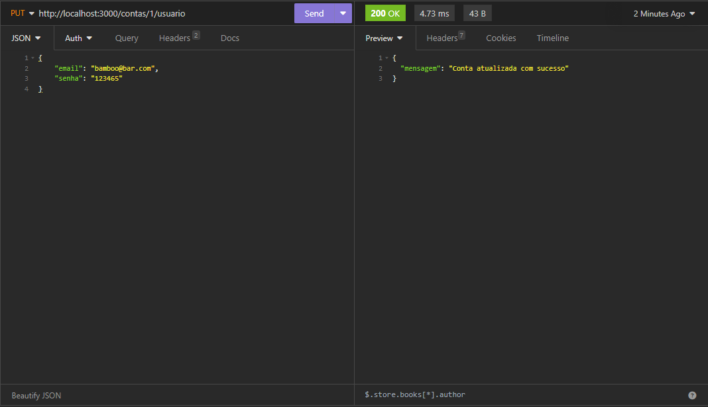
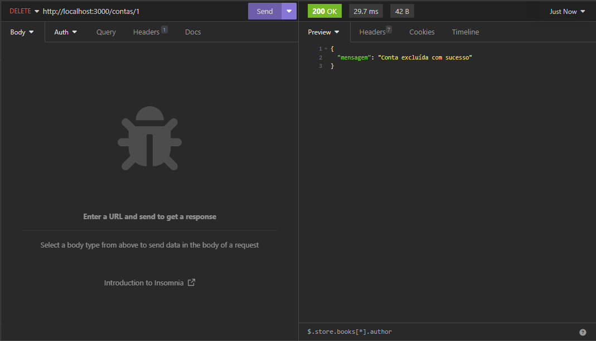
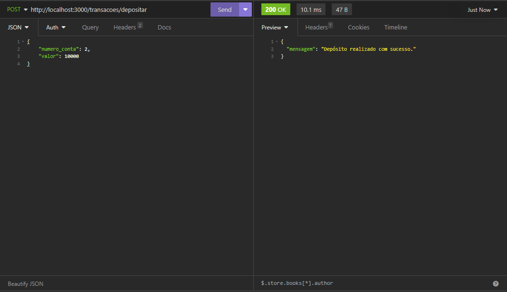
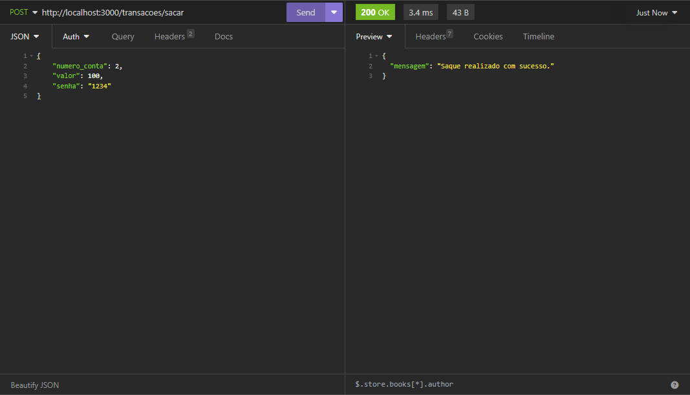
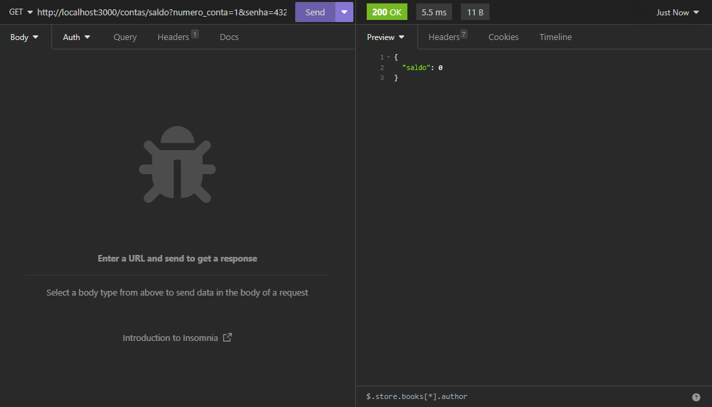
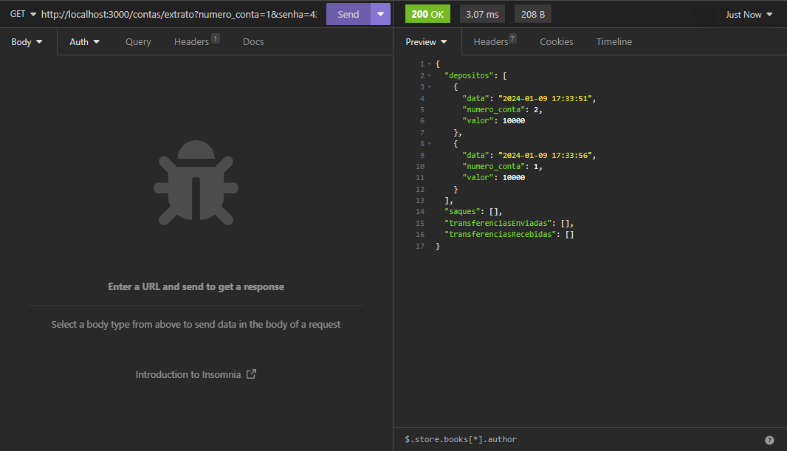

# API - Banco Digital

## About
O projeto se trata de uma RESTful API para um banco digital, escrito em [Javascript](https://developer.mozilla.org/pt-BR/docs/Web/JavaScript), no qual permite as ações:
* Listagem de contas bancárias
* Criar conta bancária
* Atualizar os dados do usuário da conta bancária
* Excluir uma conta bancária
* Depositar em uma conta bancária
* Sacar de uma conta bancária
* Transferir valores entre contas bancárias
* Consultar saldo da conta bancária
* Emitir extrato bancário

Os dados são persistidos em memória, no objeto existente dentro do arquivo bancodedados.js. Todas as transações e contas bancárias são inseridas dentro deste objeto.

É um projeto piloto, ou seja, no futuro outras funcionalidades serão implementadas.

## Rotas da API

### Listar contas bancárias
**GET /contas?senha_banco=123**

Essa é a rota que será utilizada para listar todas as contas bancárias existentes.

#### Exemplo de requisição
 **GET /contas?senha_banco=senha-do-banco**

 ( http://localhost:3000/contas?senha_banco=Money123Bank )
 
 Sem conteúdo no corpo (body) da requisição

#### Exemplos de resposta
~~~ 
// HTTP Status 200 / 201
// 2 contas encontradas
[
    {
        numero: "1",
        saldo: 0,
        usuario: {
            nome: 'Foo Bar',
            cpf: '00011122233',
            data_nascimento: '2021-03-15',
            telefone: '71999998888',
            email: 'foo@bar.com',
            senha: '1234'
        }
    },
    {
        numero: "2",
        saldo: 1000,
        usuario: {
            nome: 'Foo Bar 2',
            cpf: '00011122234',
            data_nascimento: '2021-03-15',
            telefone: '71999998888',
            email: 'foo@bar2.com',
            senha: '12345'
        }
    }
]

// HTTP Status 200 / 201
// nenhuma conta encontrada
[]
~~~
### Criar conta bancária
**POST /contas**

Essa é a rota que será utilizada para criar uma conta bancária, onde será gerado um número único para identificação de cada conta.

#### Exemplo de requisição
 **POST /contas**

 ( http://localhost:3000/contas )
~~~
 {
     "nome": "Foo Bar",
     "email": "foo@bar.com",
     "cpf": "00011122233",
     "data_nascimento": "15/03/2001",
     "telefone": "11999998888",
     "senha": "1234"
 }
~~~

#### Exemplos de resposta
~~~
// HTTP Status 200 / 201
// sucesso ao cadastrar
{
    numero:  "1",
    saldo: 0,
    usuario: {
        nome: "Foo Bar",
        cpf: "00011122233",
        data_nascimento: "2001-03-15",
        telefone: "11999998888",
        email: "foo@bar.com",
        senha: "1234"
    }
}

// HTTP Status 400, 404
// erro ao cadastrar
{
    mensagem: 'Mensagem de erro'
}
~~~
### Atualizar usuário da conta bancária
**PUT /contas/:numeroConta/usuario**

Essa é a rota que será utilizada para atualizar os dados do usuário de uma conta bancária.

#### Exemplos de requisição
 **PUT /contas/1/usuario**

 ( http://localhost:3000/contas/1/usuario )

 informando apenas um campo para atualizar
~~~
 {
     "nome": "Bar Foo"
 }
~~~
 informando todos os campos para atualizar
~~~
 {
     "nome": "Bar Foo",
     "email": "bar@foo.com",
     "cpf": "33322211100",
     "data_nascimento": "03/05/2010",
     "telefone": "11988889999",
     "senha": "4321"
 }
~~~

#### Exemplos de resposta
~~~
// HTTP Status 200 / 201
// sucesso ao atualizar
{
    mensagem: "Conta atualizada com sucesso"
}

// HTTP Status 400, 404
// erro ao atualizar
{
    mensagem: "Mensagem de erro"
}
~~~
### Excluir Conta
**DELETE /contas/:numeroConta**

Essa é a rota que será utilizada para excluir uma conta bancária existente.

#### Exemplo de requisição
 **DELETE /contas/1**

 ( http://localhost:3000/contas/1 )

 Sem conteúdo no corpo (body) da requisição

#### Exemplos de resposta
~~~
// HTTP Status 200 / 201
// sucesso ao excluir
{
    mensagem: "Conta excluída com sucesso"
}

// HTTP Status 400, 404
// erro ao excluir
{
    mensagem: "Mensagem de erro"
}
~~~
### Depositar
**POST /transacoes/depositar**

Essa é a rota que será utilizada para somar o valor do depósito ao saldo de uma conta válida e registrar essa transação.

#### Exemplo de requisição
 **POST /transacoes/depositar**

 ( http://localhost:3000/transacoes/depositar )
~~~
 {
     "numero_conta": 1,
     "valor": 10000
 }
~~~

#### Exemplos de resposta
~~~
// HTTP Status 200 / 201
// sucesso ao depositar
{
    mensagem: "Depósito realizado com sucesso"
}

// HTTP Status 400, 404
// erro ao depositar
{
    mensagem: "Mensagem de erro"
}
~~~
#### Exemplo do registro de um depósito
~~~
{
    data: "2021-08-10 23:40:35",
    numero_conta: "1",
    valor: 10000
}
~~~
### Sacar
**POST /transacoes/sacar**

Essa é a rota que será utilizada para realizar o saque de um valor em uma determinada conta bancária e registrar essa transação.

#### Exemplo de requisição
 **POST /transacoes/sacar**

 ( http://localhost:3000/transacoes/sacar )
~~~
 {
     "numero_conta": 1,
     "valor": 10000,
     "senha": "1234"
 }
~~~

#### Exemplos de resposta
~~~
// HTTP Status 200 / 201
// sucesso ao sacar
{
    mensagem: "Saque realizado com sucesso"
}

// HTTP Status 400, 404
// erro ao sacar
{
    mensagem: "Mensagem de erro"
}
~~~
#### Exemplo do registro de um saque
~~~
{
    data: "2021-08-10 23:40:35",
    numero_conta: "1",
    valor: 10000
}
~~~
### Transferir
**POST /transacoes/transferir**

Essa é a rota que será utilizada para para realizar a transferência de saldo de uma conta bancária para outra e registrar essa transação.

#### Exemplo de requisição
 **POST /transacoes/transferir**

 ( http://localhost:3000/transacoes/transferir )
~~~
 {
     "numero_conta_origem": 1,
     "numero_conta_destino": 1,
     "valor": 10000,
     "senha": "1234"
 }
~~~

#### Exemplos de resposta
~~~
// HTTP Status 200 / 201
// sucesso ao transferir
{
    mensagem: "Transferência realizado com sucesso"
}

// HTTP Status 400, 404
// erro ao transferir
{
    mensagem: "Mensagem de erro"
}
~~~
#### Exemplo do registro de uma transferência
~~~
{
    data: "2021-08-10 23:40:35",
    numero_conta_origem: "1",
    numero_conta_destino: "2",
    valor: 10000
}
~~~
### Consultar Saldo
**GET /contas/saldo?numero_conta=123&senha=123**

Essa é a rota que será utilizada para retornar o saldo de uma conta bancária.

#### Exemplo de requisição
 **GET /contas/saldo?numero_conta=numero-da-conta&senha=senha-da-conta**

 ( http://localhost:3000/contas/saldo?numero_conta=1&senha=4321 )

 Sem conteúdo no corpo (body) da requisição

#### Exemplos de resposta
~~~
// HTTP Status 200 / 201
// sucesso ao obter saldo
{
    saldo: 10000
}

// HTTP Status 400, 404
// erro ao obter saldo
{
    mensagem: "Mensagem de erro"
}
~~~
### Extrato
**GET /contas/extrato?numero_conta=123&senha=123**

Essa é a rota que será utilizada para listar as transações realizadas de uma conta específica.

#### Exemplo de requisição
 **GET /contas/extrato?numero_conta=numero-da-conta&senha=senha-da-conta**

 ( http://localhost:3000/contas/extrato?numero_conta=1&senha=4321 )

 Sem conteúdo no corpo (body) da requisição

#### Exemplos de resposta
~~~
// HTTP Status 200
// sucesso ao obter extrato
{
  depositos: [
    {
      data: "2021-08-18 20:46:03",
      numero_conta: "1",
      valor: 10000
    },
    {
      data: "2021-08-18 20:46:06",
      numero_conta: "1",
      valor: 10000
    }
  ],
  saques: [
    {
      data: "2021-08-18 20:46:18",
      numero_conta: "1",
      valor: 1000
    }
  ],
  transferenciasEnviadas: [
    {
      data: "2021-08-18 20:47:10",
      numero_conta_origem: "1",
      numero_conta_destino: "2",
      valor: 5000
    }
  ],
  transferenciasRecebidas: [
    {
      data: "2021-08-18 20:47:24",
      numero_conta_origem: "2",
      numero_conta_destino: "1",
      valor: 2000
    },
    {
      data: "2021-08-18 20:47:26",
      numero_conta_origem: "2",
      numero_conta_destino: "1",
      valor: 2000
    }
  ]
}

// HTTP Status 400, 404
// erro ao obter extrato
{
    mensagem: 'Mensagem do erro!'
}
~~~
## Run
Faça um clone do respositório para sua máquina.
Para processa-lo é necessário ter instalado o [node.js](https://nodejs.org).
No terminal instale o [express](https://expressjs.com): 
~~~
npm install express
~~~
E se preferir, instale também o [nodemon](https://nodemon.io/), programa usado para rodar o servidor:
~~~
npm install -D nodemon
~~~
Para iniciar, utilize o comando:
~~~
npm run dev
~~~
* Para finalizar o arquivo use Ctrl+C

